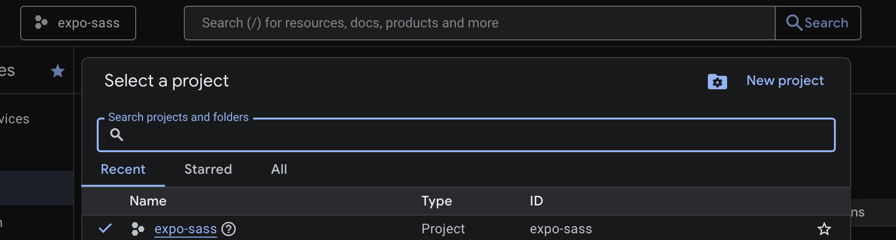

# Expo Saas Template 💵

A React Native opinionated template built with [Expo](https://expo.dev), [Supabase](https://supabase.com/) authentication, [Stripe](https://stripe.com/) payments, [RevenueCat](https://www.revenuecat.com/) subscriptions, and native Google/Apple Sign-In.

## Features

- ✅ Google Sign-In (iOS & Android)
- ✅ Apple Sign-In (iOS)
- ✅ Supabase authentication & backend
- ✅ Bottom sheet login UI
### Todo
- ⏳ RevenueCat subscriptions (coming next)
- ⏳ Apple payment
- ⏳ Stripe payments 
- ⏳ Push Notifications with firebase and expo
- ⏳ Emails with [resend](https://resend.com/emails)

## Prerequisites

Before you start, make sure you have:

- **Node.js** (v18 or higher) - [Download](https://nodejs.org/)
- **npm** or **yarn** package manager
- **Xcode** (for iOS development) - [Download](https://developer.apple.com/xcode/)
- **Android Studio** (for Android development) - [Download](https://developer.android.com/studio)
- **Apple developer account** For making your app live [Create](https://developer.apple.com/account) ($99 a year)
- **Expo acccount** Create an account with [Expo](https://expo.dev/)
- **EAS CLI** - Install with `npm install -g eas-cli`

## Nice to have
- **[Expo Orbit](https://expo.dev/orbit)** (highly recommended for running emulators)

## Quick Start

### 1. Clone the Template

```bash
git clone https://github.com/yourusername/expo-sass-template.git my-app
```

```bash
cd my-app
```

### 2. Configure Your Project

You need to customize several files to make this template your own.

#### A. Update `package.json`

Open `package.json` and change:

```json
{
  "name": "expo-sass",  // Change to your project name
  "version": "1.0.0"
}
```

#### B. Update `app.json`

Open `app.json` and update the following fields:

```json
{
  "expo": {
    "name": "expo-sass",              // Your app display name
    "slug": "Expo SaaS",              // URL-friendly identifier
    "scheme": "exposass",             // Deep linking scheme (lowercase, no spaces)
    "ios": {
      "bundleIdentifier": "com.rolandobarbella.exposass"  // Your unique iOS bundle ID
    },
    "android": {
      "package": "com.rolandobarbella.exposass"  // Your unique Android package name
    },
    "extra": {
      "eas": {
        "projectId": ""  // Leave empty for now, will be filled when you run 'eas build'
      }
    }
  }
}
```

**Important naming conventions:**
- Bundle Identifier (iOS): Reverse domain notation (e.g., `com.yourcompany.appname`)
- Package Name (Android): Same format as bundle identifier
- Scheme: Lowercase, no spaces (e.g., `myapp`, `mycompanyapp`)

### 3. ENV

Rename the .env.example file for .env.local or .env

### 4. Create a Supabase Project

1. Go to [Supabase](https://supabase.com/) and create a free account
2. Click "Start New project"
3. Choose your organization and set a database password
4. On the left bar, go to **Project Settings** > **Data API** > ***Project URL** and copy: URL (e.g., `https://jskokp.supabase.co`)
5. On the left bar go to **Project Settings** > **API keys** > ***Legacy anon, service_role API keys tab** and copy: Anon/Public Key (starts with `eyJ...`)
6. Paste this two values on your `.env.local`, EXPO_PUBLIC_SUPABASE_URL and EXPO_PUBLIC_SUPABASE_ANON_KEY

### 5. Create a Google Cloud Project (for Google Sign-In)

1. Go to [Google Cloud Console](https://console.cloud.google.com/)

2. Create a new project or select an existing one



3. Add credentials
   - Go to **APIs & Services** >  **Credentials** > **Create credentials**
   - Configure the consent screen if you haven't already, select the **External** checkbox, then add the rest of the app information 
   - Then  **Create Credentials** > **OAuth client ID**

   **iOS Client:**
      - Application type: **iOS**
      - Name: "My App iOS" or leave the default one
      - Bundle ID: `com.yourcompany.yourapp` (must match `app.json`)
      - Copy the **Client ID**, pasted the id in the .env.local file, EXPO_PUBLIC_IOS_CLIENT_ID

   **Android Client:**
      - Application type: **Android**
      - Name: "My App Android"
      - Package name: `com.yourcompany.yourapp` (must match `app.json`)
      - SHA-1 certificate fingerprint: Get this by running:
      ```bash
      # For development
      keytool -keystore ~/.android/debug.keystore -list -v
      # Password is usually 'android'
      ```
      - Copy the **Client ID**, Pasted the id in the .env.local file, EXPO_PUBLIC_ANDROID_CLIENT_ID

   **Web Client (required for the auth flow):**
   - Application type: **Web application**
   - Name: "My App Web" or the defualt one
   - On the **Authorised JavaScript origins**, add: `http://localhost:8081`
   - Leave the Authorised redirect URIs empry for now (we will come back to in a next step)
   - Copy the **Client ID** and added to the .env.local file, EXPO_PUBLIC_WEB_CLIENT_ID


💡 Helpful [video](http://youtube.com/watch?v=BDeKTPQzvR4) about all this Google setup

### 4. Supabase Auth setup

1. Go to your project
2. On the left bar, go to **Authentication** > **Sign In/Providers"** 
3. Enable Apple and Google
4.1 On Apple, add the client id: `com.yourcompany.appname`
4.2 On Google, add the client id: with the following values: 
`EXPO_PUBLIC_ANDROID_CLIENT_ID, + EXPO_PUBLIC_IOS_CLIENT_ID, + EXPO_PUBLIC_WEB_CLIENT_ID` (don't forget the commas)
5. Copy the Callback URL (for OAuth) from Google or Apple (looks like `https://dlugycn.supabase.co/auth/v1/callback`)
6. Go back to your Web Client credential in Google claude and paste the adress in the **Authorised redirect URIs** field
   
### 5. Update `app.json`  with your iOS Web Client ID:
Find the plugging section and replace with your iOS Web Client ID (reversed format):

```json
   {
     "plugins": [
       [
         "@react-native-google-signin/google-signin",
         {
           "iosUrlScheme": "com.googleusercontent.apps.EXPO_PUBLIC_IOS_CLIENT_ID"
         }
       ]
     ]
   }
```

### 6. Install Dependencies and build

```bash
npm install
```

```bash
npx expo prebuild
```
*This should create the ios and android folder

### 7 Fully getting the apple login to work with eas

1. eas build -p ios
2. This should have created the credentianls in your [apple connect](https://developer.apple.com/account/resources/identifier)
3. After creating the build succesfully, go to your project on [expo](https://expo.dev/), on the left bar click on Credential 
💡 Helpful [video](https://www.youtube.com/watch?v=tqxTijhYhp8) about all this Apple setup


### 7. Run the App (with your emulator running)

```bash
npx expo start
```

## More about expo

To learn more about developing your project with Expo, look at the following resources:
- [Expo documentation](https://docs.expo.dev/): Learn fundamentals, or go into advanced topics with our [guides](https://docs.expo.dev/guides).

## Skills

https://skills.sh/trending

### Apple Sign In


### Building for Testing

Apple Sign In requires a **development build** (not Expo Go):

```bash
# Build for iOS
eas build -p ios --profile development

# Build for Android (Google only)
eas build -p android --profile development
```

## Troubleshooting
1. Clear caches — npx expo start --clear
2. Clean prebuild — npx expo prebuild --clean
3. Review console warnings — Legacy modules log compatibility warnings

## Expo community

- [Expo on GitHub](https://github.com/expo/expo): View our open source platform and contribute.
- [Discord community](https://chat.expo.dev): Chat with Expo users and ask questions.
