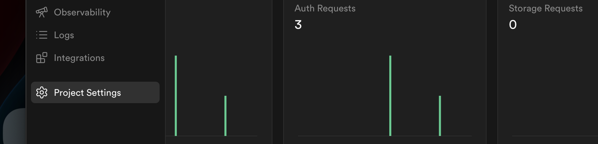
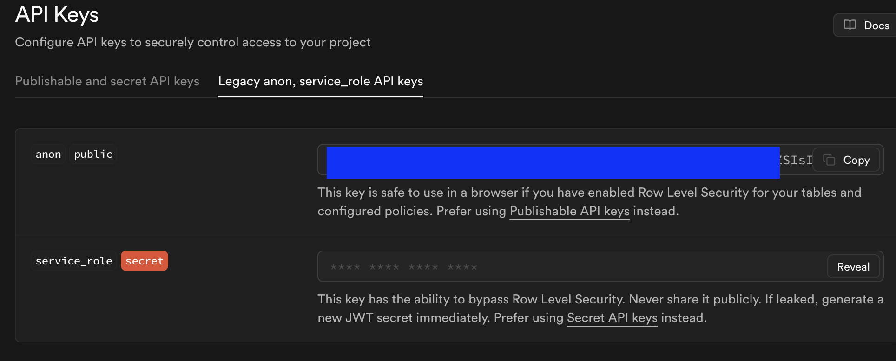
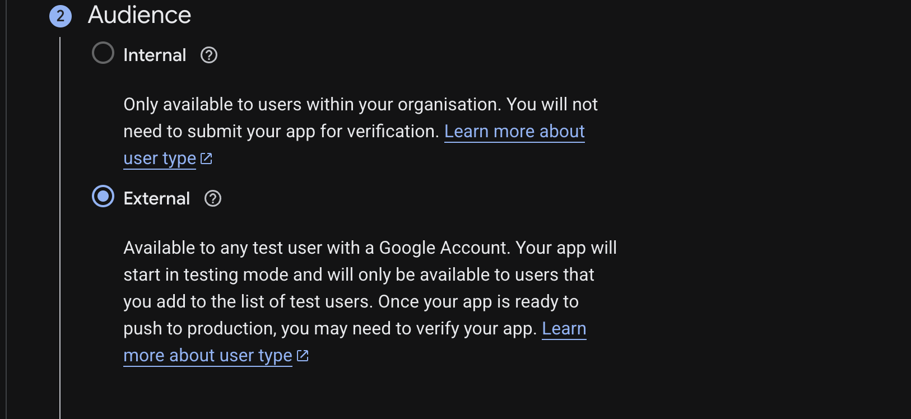
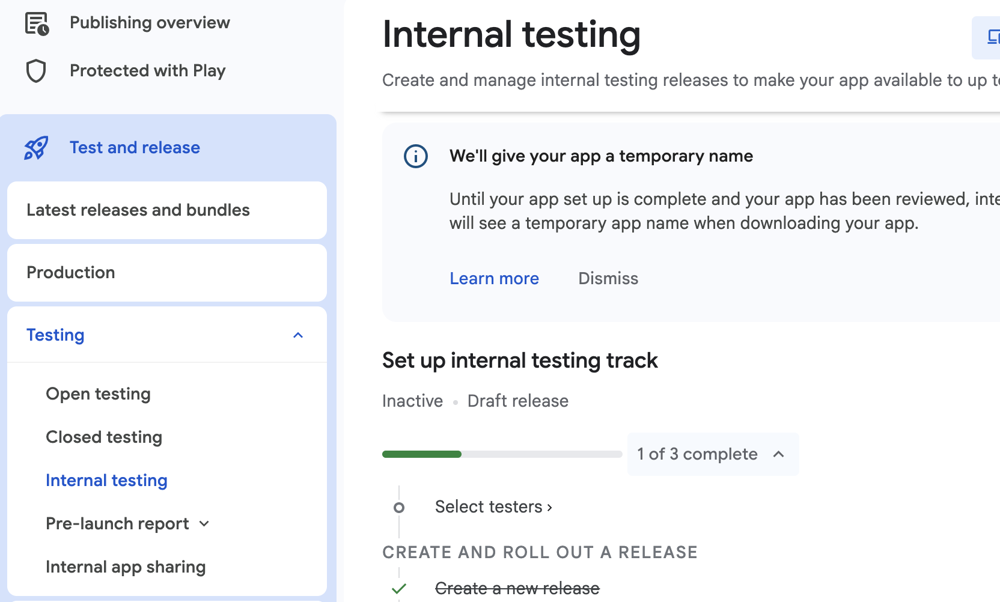
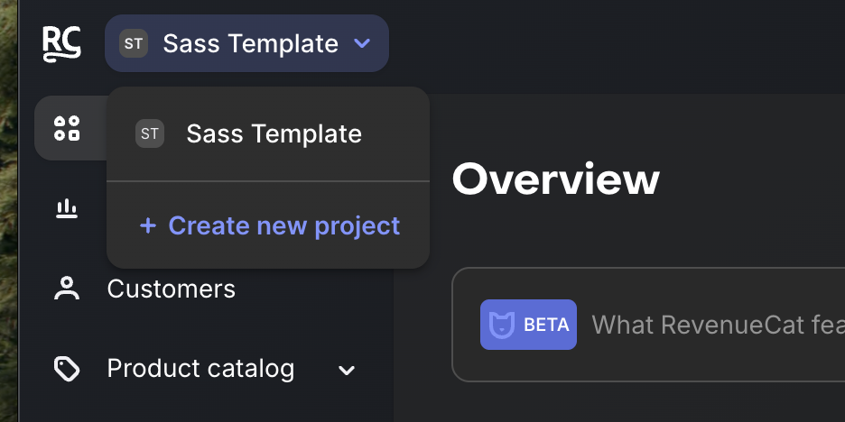
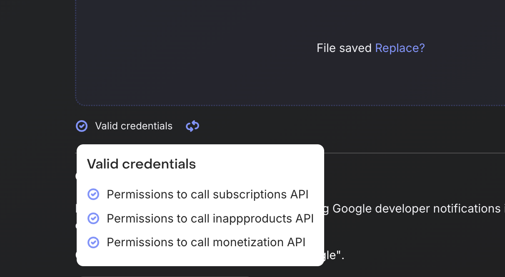

# Expo Saas Template 💵

A React Native opinionated template built with [Expo](https://expo.dev), [Supabase](https://supabase.com/) authentication, [Stripe](https://stripe.com/) payments, [RevenueCat](https://www.revenuecat.com/) subscriptions, and native Google/Apple Sign-In.

## Features

- ✅ Google Sign-In (iOS & Android)
- ✅ Apple Sign-In (iOS)
- ✅ Supabase authentication & backend
- ✅ Bottom sheet login UI
### Todo
- ⏳ RevenueCat subscriptions (coming next)
- ⏳ Apple payment
- ⏳ Stripe payments 
- ⏳ Push Notifications with Firebase and Expo
- ⏳ Emails with [resend](https://resend.com/emails)
- ⏳ Husky + Eslint complete setyp

## Prerequisites

Before you start, make sure you have:
- **Node.js** (v18 or higher) - [Download](https://nodejs.org/)
- **npm** or **yarn** package manager
- **Xcode** for iOS development - [Download](https://developer.apple.com/xcode/)
- **Apple developer account** For making your app live [Create](https://developer.apple.com/account) ($99 a year)
- **Expo acccount** Create an account with [Expo](https://expo.dev/)
- **EAS CLI** - Install with `npm install -g eas-cli`

#### If you planning releasing in Android

- **Android Studio** for Android development [Download](https://developer.android.com/studio)
- **Google play** developer [account](https://play.google.com/console/signup) (25$ lifetime)

## Nice to have
- **[Expo Orbit](https://expo.dev/orbit)** (highly recommended for running emulators)

## Quick Start

### 1. Clone the Template

```bash
git clone https://github.com/Rolando-Barbella/expo-sass-template my-app
```

```bash
cd my-app
```

### 2. Configure Your Project

You need to customize several files to make this template your own.

#### A. Update `package.json`

Open `package.json` and change:

```json
{
  "name": "expo-sass",  // Change to your project name
  "version": "1.0.0"
}
```

#### B. Update `app.json`

Open `app.json` and update the following fields:

```json
{
  "expo": {
    "name": "Expo Sass",              // This is how it will show in your phone icon, 2 words recommend it
    "slug": "expo-sass",              // Follow this format
    "scheme": "exposass",             // Deep linking scheme (lowercase, no spaces)
    "ios": {
      "bundleIdentifier": "com.rolandobarbella.exposass"  // Your unique iOS bundle ID
    },
    "android": {
      "package": "com.rolandobarbella.exposass"  // Your unique Android package name
    },
    "extra": {
      "eas": {
        "projectId": ""  // Leave empty for now, will be filled when you run 'eas build'
      }
    }
  }
}
```

**Important naming conventions:**
- Bundle Identifier (iOS): Reverse domain notation (e.g., `com.yourcompany.appname`)
- Package Name (Android): Same format as bundle identifier
- Scheme: Lowercase, no spaces (e.g., `myapp`, `mycompanyapp`)

### 3. ENV

Rename the .env.example file for .env.local or .env

### 4. Create a Supabase Project

1. Go to [Supabase](https://supabase.com/) and create a free account
2. Click `Start New project`
3. Choose your organization and set a database password
4. Go to your [dashboard](https://supabase.com/dashboard/), choose your project
5. On the left bar, go to **Project Settings** 

6. Go to the second left bar, under **Configuration** go to > **Data API** > ***API URL** and copy: URL (e.g., `https://jskokp.supabase.co`)
6. On the left bar again, go to **Project Settings** > **API keys** > ***Legacy anon, service_role API keys tab** and copy: anon public Key (starts with `eyJ...`)

7. Paste these two values on your `.env.local` or `.env`, EXPO_PUBLIC_SUPABASE_URL and EXPO_PUBLIC_SUPABASE_ANON_KEY

## LOG IN
This covers Google and Apple sign in ( no usermane and pasword )

*IMPORTANT: If you are planning to lunch your app for iOS, you must have apple sign in, otherwise, it would be rejected, don't miss this step

### Create a Google Cloud Project (for Google Sign-In)

1. Go to [Google Cloud Console](https://console.cloud.google.com/)

2. Create a new project or select an existing one


3. Add credentials
   - Go to **APIs & Services** >  **Credentials** > **Create credentials**
   - Google will ask you to configure the consent screen 
   - In the Audience part, select the **External** checkbox, then add the rest of the app information 
   
   - On the left menu, go again to **APIs & Services** >  **Create Credentials** > **OAuth client ID**

   **iOS Client:**
      - Application type: **iOS**
      - Name: "My App iOS" or leave the default one
      - Bundle ID: `com.yourcompany.yourapp` (must match `app.json`)
      - Copy the **Client ID**, pasted the id in the .env.local file, EXPO_PUBLIC_IOS_CLIENT_ID

   **Android Client:**
      - Application type: **Android**
      - Name: "My App Android"
      - Package name: `com.yourcompany.yourapp` (must match `app.json`)
      - SHA-1 certificate fingerprint: Get this by running:
      ```bash
      # For development
      keytool -keystore ~/.android/debug.keystore -list -v
      # Password is usually 'android'
      ```
      - Copy the **Client ID**, Pasted the id in the .env.local file, EXPO_PUBLIC_ANDROID_CLIENT_ID

   **Web Client (required for the auth flow):**
   - Application type: **Web application**
   - Name: "My App Web" or the defualt one
   - On the **Authorised JavaScript origins**, add: `http://localhost:8081`
   - Leave the Authorised redirect URIs empty for now (we will come back to in a next step)
   - Copy the **Client ID** and added to the .env.local file, EXPO_PUBLIC_WEB_CLIENT_ID


💡 Helpful [video](http://youtube.com/watch?v=BDeKTPQzvR4) about all this Google setup

### 4. Supabase Auth setup

1. Go to your project again
2. On the left bar, go to **Authentication** > under Configurations, select **Sign In/Providers"** 
3. Enable Apple and Google
4. On Apple, add the client id: `com.yourcompany.appname`
5. On Google, add the client id: with the following values: 
`EXPO_PUBLIC_ANDROID_CLIENT_ID, + EXPO_PUBLIC_IOS_CLIENT_ID, + EXPO_PUBLIC_WEB_CLIENT_ID` (don't forget the commas)
5. Copy the Callback URL (for OAuth) from Google or Apple (looks like `https://dlugycn.supabase.co/auth/v1/callback`)
6. Go back to your Web Client credential in Google claude and paste the adress in the **Authorised redirect URIs** field
   
### 5. Update `app.json` with your iOS Web Client ID:
Find the plugging section and replace with your EXPO_PUBLIC_IOS_CLIENT_ID with reversed format (instead of 123jsjs.apps.googleusercontent.com, it woule be: com.googleusercontent.apps.123jsjs)

```json
   {
     "plugins": [
       [
         "@react-native-google-signin/google-signin",
         {
           "iosUrlScheme": "com.googleusercontent.apps.EXPO_PUBLIC_IOS_CLIENT_ID"
         }
       ]
     ]
   }
```

### Apple login and eas

1. Run `eas build -p ios` (if you have never use eas with expo, check this [video](https://www.youtube.com/watch?v=uQCE9zl3dXU) first)
2. This should have created the indentifiers in your [apple connect](https://developer.apple.com/account/resources/identifier/list) account, with the ability to sign in
3. Go to your project on [expo](https://expo.dev/), on the left bar click on Credential and check that your app credentials have been saved


💡 Helpful [video](https://www.youtube.com/watch?v=tqxTijhYhp8) about all this Apple setup

## Install Dependencies, build and run the app

```bash
npm install
```

```bash
npx expo prebuild
```
*This should create the ios and android folder

```bash
npx expo run:ios or npx expo run:android
```

## RevenueCat subscriptions with Android

Pay attention to each step, you are going to be navigating between the Google Paly Console and Google Console page a lot, they can be quiet confusing

1. Create a new app in the [Google Play Console](https://play.google.com/console/u/0/developers/), add the app name, the package name ( located ate in your app.json file, specifically the android objet, exp: com.yourname.appname), select free app, and confirm both declarations.
2. Create a build with expo if you haven’t: eas build
3. Download the .aab file (we will come back to this later)

### Make a new release
1. After succesfully creating the app ( make sure it is selected ), on the left bar, go to t `Test and release` > `Internal testing`

2. Press on the `Create new release` button
3. Upload the .aab file dowloaded before 
4. Press Next, then Save and Publish

*Your app should be now available for internal publisher

### Create Subscription in the Google Play Console
1. In that same page where the release was created (or navigating from your project at [Google Play Console](https://play.google.com/console/u/0/developers/)), on the left bar, go to `Monetize with Play` > `Products` > `Subscriptions` 
3. Create a subscription 
4. Add the product id, exp: `new_app_subscription`
5. Add a name and save

#### Subscription benefits
1. Press on `Add subscription benefits (recommended)`, and add as many bennefits your app needs
2. The `Tax, compliance and programmes` can be leave empty for now
3. Save it

#### Base plan
1. Go back where the subscription lives
2. Add a base plan, call it `default` or which ever name makes sense
3. Check the `Auto-renewing option` option
4. Select what makes sense for your app (billing period, grace period, etc)
5. In the `Price and availability` section, add a price to your subscription by pressing the `Set prices` ( small blue text button )
6. Add countries and amount you planning to charge 
7. Press activate

### Google Play Console and Google Cloud Credentials
1. Go to your Google Cloud [account](https://console.cloud.google.com/)
2. Create a new project on the top bar

3. Go to the [Google Play Android Developer API page](https://console.cloud.google.com/apis/library/androidpublisher.googleapis.com) and the [Google Play Developer Reporting API page](https://console.cloud.google.com/apis/library/playdeveloperreporting.googleapis.com) in Google Cloud Console.
4. Press enable on both sites
5. You should now see a `Create credentials` button in both pages

#### Google Play Android Developer API page
*You can also check this [video](https://www.youtube.com/watch?v=fOr2fu-0Vs8&t=2s) from 
RevenueCat team

1. Make sure you select `Google Play Android Developer API` and `Application data`, then click next 
2. Add a name to the services account (exp: rn services account )
3. Next, we need to add two permissions: one called `Pub/Sub Editor`, another one called `Monitoring viewer`, and press continue
4. Last step, just press `Done`
5. After the last step, you will see 3 taps (Metrics, Quaotas, Credentials), press on Credentials one, copy the email you see in the Service Account, save it for later
6. Press on `Manage service accounts`
7. In the Service accounts page, press on the 3 bullets Actions button (right end corner ), click on `Manage keys`
8. Press `Add key` > `Create new key`, Select the JSON option, it should be now save in your machine

#### Cloud Pub/Sub API permission
1. Go to your Google Cloud [page](https://console.cloud.google.com/) 
2. Press `Enable`

#### Invite user in Google Play Console
1 Got to your Play Console [list](https://play.google.com/console/u/0/developers)
2. On the left bar, press on `Users and permissions` 
3. Invite a new user
4. Add the email you created in the previos step (Google Play Android Developer API page > step 5)
5. In the `App permissions` tab, Add your app in the `Add app` dropdown button
6. Press the `Account permissions` tab, select the following: 
- View app information and download bulk reports (read only) 
- View financial data, orders and cancellation survey responses
- Manage orders and subscriptions
7. Press `Invite user` and `Send`

By now, you should be done with all the google steps 🫰

### Revenue Cat Setup
1. Create a new [account](https://www.revenuecat.com/) if you have not already
2. In your [projects](https://app.revenuecat.com/projects/) page, create a new project 
3. There will be some options and questions screens, you can avoid them for now and go to the dashboard

#### Entitlements
1. On the left side bar, go to `Product catalog` > `Entitlements`
2. Add a new one by given it a name

#### Apps & providers
1. On the left bar, go to Apps & providers > Configurations
2. Select `New app configuration` ( the one with the apple, android, amazon icons )
3. Select Google Play Store
4. Create your `New Play Store configuration` by adding a name, and the package name ( the loacted on your app.json file )
4.1 Upload the `Service account credentials` created on the previos Google steps (Google Play Android Developer API page > step 8)
By now, yout revenuecat credentials page should look like this: 
If not, review the previos steps

*It can take up to 36 hours for your Play Service Credentials to work properly with the Google Play Developer API


3. Go to configurations [here](https://www.revenuecat.com/docs/getting-started/quickstart#2-product-configuration)

## Skills
There are some skills files already, feel free to use more

https://github.com/expo/skills

https://skills.sh/trending

## Troubleshooting
1. Clear caches — npx expo start --clear
2. Clean prebuild — npx expo prebuild --clean
3. Review console warnings — Legacy modules log compatibility warnings

## More about Expo

To learn more about developing your project with Expo, look at the following resources:
- [Expo documentation](https://docs.expo.dev/): Learn fundamentals, or go into advanced topics with our [guides](https://docs.expo.dev/guides).


## Expo community

- [Expo on GitHub](https://github.com/expo/expo): View our open source platform and contribute.
- [Discord community](https://chat.expo.dev): Chat with Expo users and ask questions.
