# Expo SaaS Template 💵

Opinionated React Native template built with [Expo](https://expo.dev), [Supabase](https://supabase.com/), [Stripe](https://stripe.com/), [RevenueCat](https://www.revenuecat.com/), and native Google/Apple Sign-In.

Most features have been tested on iOS first.

## Menu

- [Quick start](#quick-start)
- [Expo SDK and upgrades](#expo-sdk-and-upgrades)
- [Authentication setup](#authentication-setup)
  - [Google Sign-In](#google-sign-in)
  - [Apple Sign-In and EAS](#apple-sign-in-and-eas)
- [Push Notifications](#push-notifications)
  - [Android](#push-notifications-android)
  - [iOS](#push-notifications-ios)
- [RevenueCat setup](#revenuecat-setup)
  - [Android subscription setup](#android-subscription-setup)
  - [iOS subscription setup](#ios-subscription-setup)
- [Troubleshooting](#troubleshooting)
- [Extra resources](#extra-resources)

## What You Get

### Included ✅

- Google Sign-In for iOS and Android
- Apple Sign-In for iOS
- Supabase authentication and backend integration
- Bottom sheet login UI
- RevenueCat subscriptions
- Android push notifications with Firebase Cloud Messaging and Expo

### Planned ⏳

- Emails with [Resend](https://resend.com/emails)

## Prerequisites

Before starting, make sure you have:

- [Node.js](https://nodejs.org/) `20.19.4+`
- `npm` or `yarn`
- [Xcode](https://developer.apple.com/xcode/) for iOS development
- An [Apple Developer account](https://developer.apple.com/account) for App Store release
- An [Expo account](https://expo.dev/)
- A [Firebase account](https://console.firebase.google.com/) for Android push notifications
- `eas-cli` installed: `npm install -g eas-cli`

If you plan to release on Android, you also need:

- [Android Studio](https://developer.android.com/studio)
- A [Google Play developer account](https://play.google.com/console/signup)

Nice to have:

- [Expo Orbit](https://expo.dev/orbit) for running emulators

## Quick Start

### 1. Clone the template

```bash
git clone https://github.com/Rolando-Barbella/expo-sass-template my-app
cd my-app
```

### 2. Customize project identity

Update `package.json` with your details:

```json
{
  "name": "expo-sass",
  "version": "1.0.0"
}
```

Update `app.json`:

Naming rules:

- iOS bundle identifier: reverse-domain format, for example `com.yourcompany.appname`
- Android package name: usually the same format as the iOS bundle identifier
- App scheme: lowercase, no spaces, for example `myapp`

```json
{
  "expo": {
    "name": "Expo Sass",
    "slug": "expo-sass",
    "scheme": "exposass",
    "ios": {
      "bundleIdentifier": "com.rolandobarbella.exposass"
    },
    "android": {
      "package": "com.rolandobarbella.exposass"
    },
    "extra": {
      "eas": {
        "projectId": ""
      }
    }
  }
}
```

### 3. Create your environment file

Rename `.env.example` to `.env.local` or `.env`.

### 4. Install dependencies and run the native app

```bash
npm install
```

Create native projects:

```bash
npx expo prebuild
```

Run a platform build:

```bash
npx expo run:ios
```

```bash
npx expo run:android
```

This creates the `ios/` and `android/` folders.

### 5. Create a Supabase project

1. Create a project in [Supabase](https://supabase.com/).
2. Open your project dashboard.
3. Go to `Project Settings`.
4. Under `Configuration`, open `Data API` and copy the API URL.
5. Under `API keys`, copy the public anon key.
6. Add both values to your env file:

```bash
EXPO_PUBLIC_SUPABASE_URL=...
EXPO_PUBLIC_SUPABASE_ANON_KEY=...
```

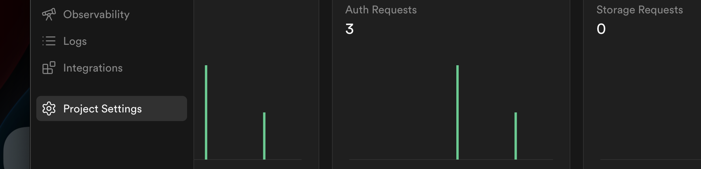
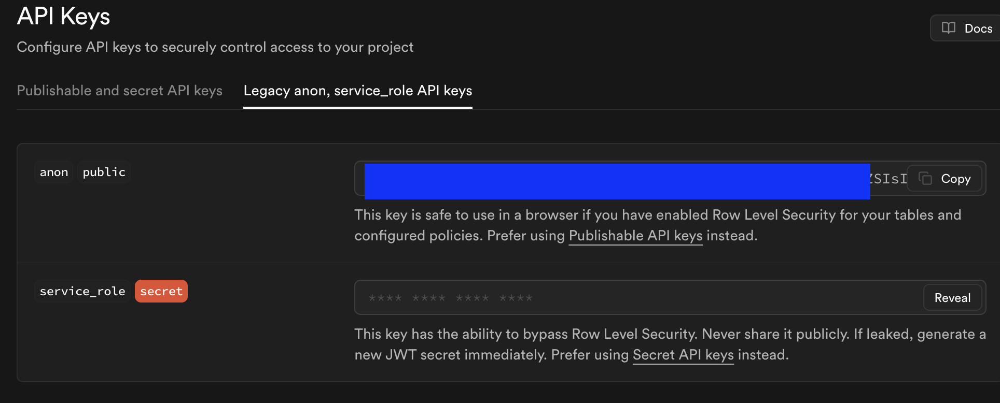

<a id="expo-sdk-and-upgrades"></a>

## Authentication Setup

This template supports Google Sign-In and Apple Sign-In.

IMPORTANT: For iOS App Store release, Apple Sign-In is required if you provide third-party sign-in, otherwise your app will be rejected.

<a id="google-sign-in"></a>

### Google Sign-In 🔐

#### 1. Create a Google Cloud project

1. Open [Google Cloud Console](https://console.cloud.google.com/).
2. Create a new project or select an existing one.
3. Go to `APIs & Services` > `Credentials`.
4. If prompted, configure the consent screen first.
5. In the audience section, choose `External` and complete the basic app information.

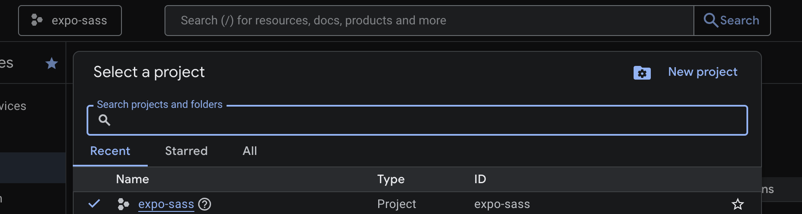
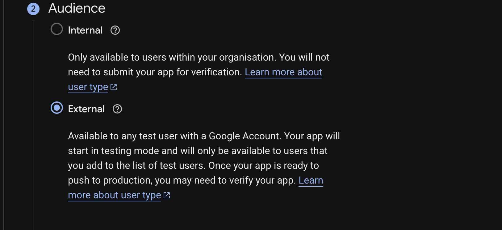

#### 2. Create OAuth clients

Create these three OAuth client types:

`iOS`

- Application type: `iOS`
- Bundle ID: must match `app.json`
- Save the generated client ID as `EXPO_PUBLIC_IOS_CLIENT_ID`

`Android`

- Application type: `Android`
- Package name: must match `app.json`
- Add the SHA-1 fingerprint from:

```bash
keytool -keystore ~/.android/debug.keystore -list -v
```

The default debug keystore password is usually `android`.

- Save the generated client ID as `EXPO_PUBLIC_ANDROID_CLIENT_ID`

`Web`

- Application type: `Web application`
- Add `http://localhost:8081` to `Authorized JavaScript origins`
- Leave redirect URIs empty for now
- Save the generated client ID as `EXPO_PUBLIC_WEB_CLIENT_ID`

Helpful video: [Google setup walkthrough](http://youtube.com/watch?v=BDeKTPQzvR4)

### Supabase Auth Provider Setup

1. In Supabase, open `Authentication` > `Sign In / Providers`.
2. Enable Apple and Google.
3. For Apple, add your app client ID such as `com.yourcompany.appname`.
4. For Google, add this 3 variables separated with commas:
   `EXPO_PUBLIC_ANDROID_CLIENT_ID`, `EXPO_PUBLIC_IOS_CLIENT_ID`, `EXPO_PUBLIC_WEB_CLIENT_ID`
5. Copy the callback URL shown by Supabase.
6. Return to your Google web client and add that URL to `Authorized redirect URIs`.

### Update `app.json` for Google Sign-In

Replace `EXPO_PUBLIC_IOS_CLIENT_ID` in the plugin config with the real iOS client ID value:

```json
{
  "plugins": [
    [
      "@react-native-google-signin/google-signin",
      {
        "iosUrlScheme": "com.googleusercontent.apps.YOUR_IOS_CLIENT_ID"
      }
    ]
  ]
}
```

<a id="apple-sign-in-and-eas"></a>

### Apple Sign-In and EAS 

1. Run an iOS build:

```bash
eas build -p ios
```

2. Check that identifiers were created in your [Apple Developer account](https://developer.apple.com/account/resources/identifier/list).
3. In your Expo project, open `Credentials` and confirm the app credentials were saved.

Helpful video: [Apple Sign-In setup walkthrough](https://www.youtube.com/watch?v=tqxTijhYhp8)

Test the app again after finishing auth setup:

```bash
npx expo run:ios
```

```bash
npx expo run:android
```

<a id="push-notifications"></a>

## Push Notifications 🔔

Choose the platform path you need:

- **Android only:** complete the shared setup, then the [Android](#push-notifications-android) setup.
- **iOS only:** complete the shared setup, then the [iOS](#push-notifications-ios) setup. Firebase is not required.
- **Both platforms:** complete the shared setup once, then complete both platform sections.

### Shared Setup for Android and iOS

The template includes a shared end-to-end notification example. Pressing the **Push Notifications** card requests permission, gets the device's Expo push token, and asks Expo's push service to deliver a notification back to that device. The notification itself is the success signal; a modal appears only when an error occurs.

The shared implementation lives in:

- `lib/notifications.ts`: permission handling, Expo push-token registration, Android channel creation when running on Android, and the request to Expo's push API
- `providers/PushNotificationsProvider.tsx`: foreground notification behavior and received/opened listeners
- `app/_layout.tsx`: installs the notification provider at the app root
- `app/index.tsx`: interactive card, loading state, and error-only alert

Link the app to an EAS project if it is not linked already:

```bash
eas init
```

This writes the EAS project ID to `expo.extra.eas.projectId`. The notification helper uses that ID when requesting an Expo push token.

Add the shared notifications plugin and EAS project ID to `app.json`:

```json
{
  "expo": {
    "plugins": [
      [
        "expo-notifications",
        {
          "icon": "./assets/images/android-icon-monochrome.png",
          "color": "#E6F4FE"
        }
      ]
    ],
    "extra": {
      "eas": {
        "projectId": "YOUR_EAS_PROJECT_ID"
      }
    }
  }
}
```

The plugin is required for both platforms. Its `icon` and `color` options customize Android notifications.

Push notifications require a native build and are not supported in Expo Go. Each platform also needs its own credentials and a new native build, as described below.

<a id="push-notifications-android"></a>

### Android 🤖

Android uses Firebase Cloud Messaging (FCM). It does not use Apple APNs credentials.

The checked-in template is already connected to Firebase project `expo-sass-template`, Android package `com.rolandobarbella.exposass`, and EAS project `@rolando-barbella/expo-sass`. Its non-secret EAS project ID and `google-services.json` are configured. Forks should replace them with your own Firebase app, package name, and EAS project.

#### 1. Create and connect the Firebase Android app

1. Open the [Firebase console](https://console.firebase.google.com/) and create or select a project.
2. Add an Android app. Its package name must exactly match `expo.android.package` in `app.json`.
3. Download `google-services.json` and place it in the project root.
4. Point Expo to that file in `app.json`:

```json
{
  "expo": {
    "android": {
      "package": "com.yourcompany.appname",
      "googleServicesFile": "./google-services.json"
    }
  }
}
```

`google-services.json` contains public-facing Android client identifiers and may be committed. It is not the private Firebase service-account key.

#### 2. Upload the FCM V1 credential to EAS

1. In Firebase, open `Project settings` > `Service accounts`.
2. Click `Generate new private key` and download the service-account JSON.
3. Run:

```bash
eas credentials --platform android
```

4. Select the build profile, then `Google Service Account` > `Manage your Google Service Account Key for Push Notifications (FCM V1)` > `Set up a Google Service Account Key for Push Notifications (FCM V1)`.
5. Upload the service-account JSON.

The service-account JSON is secret. Never commit or ship it. After EAS stores it, remove the local copy or move it to a secure secret manager. The template ignores `firebase-service-account*.json`; also ignore the exact filename if yours uses another name.

#### 3. Build and test Android

Use a physical Android device or an Android emulator image with Google Play services. Rebuild after adding or changing `google-services.json` or the notification plugin:

```bash
npx expo run:android
```

Open the app, press the **Push Notifications** card, grant permission, and wait a few seconds for delivery.

Android reference: [Expo FCM V1 credentials guide](https://docs.expo.dev/push-notifications/fcm-credentials/).

<a id="push-notifications-ios"></a>

### iOS 

iOS uses Apple Push Notification service (APNs). It does not use Firebase, FCM credentials, or `google-services.json`.

The shared TypeScript implementation, `expo-notifications` plugin, EAS project ID, and test card are already ready for iOS. The remaining work is Apple credential setup and a signed iOS rebuild.

#### 1. Prepare the Apple app and credentials

1. Use a paid [Apple Developer Program](https://developer.apple.com/programs/) account with permission to manage certificates, identifiers, and profiles.
2. Confirm the App ID matching the `com.youraccount.bundleIdentifier` in `app.json` exists in the Apple Developer portal. For this template it is `com.rolandobarbella.exposass`.

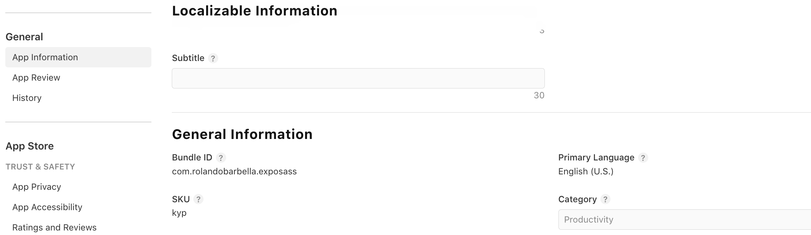

3. Configure an APNs key:

   ```bash
   eas credentials --platform ios
   ```

   Select the appropriate build profile, then `Push Notifications: Manage your Apple Push Notifications Key`, and allow EAS to generate or reuse a key. The first EAS iOS build can also prompt you to enable push notifications and generate the key.

EAS should enable the App ID's Push Notifications capability and manage the required provisioning profile. If the profile predates that capability, allow EAS to regenerate it during the next build.

#### 2. Prepare an iOS development build

For a physical iPhone or iPad, register the device if needed:

```bash
eas device:create
```
Create and install a new signed build containing the Push Notifications capability and `aps-environment` entitlement:

```bash
eas build --platform ios --profile development
```

#### 3. Test iOS

Start Metro and open the installed development build:

```bash
npx expo start --dev-client
```

Press the **Push Notifications** card, grant permission, and wait for delivery.

You can test on a physical iPhone or iPad. Expo also supports an iOS Simulator running iOS 16+ with Xcode 14+ on macOS 13+. The current EAS development profile targets registered physical devices; for a simulator, use `npx expo run:ios` locally or add a separate EAS profile with `ios.simulator: true`.

Apple limits APNs authentication keys per developer account, and one key may serve multiple apps. Do not revoke a shared key without checking which production apps use it.

iOS references: [EAS-managed push credentials](https://docs.expo.dev/app-signing/managed-credentials/#push-notification-credentials) and [iOS development builds](https://docs.expo.dev/tutorial/eas/ios-development-build-for-devices/).

### Shared Production Note

The card sends directly to Expo's push endpoint only as a self-contained development example. For either platform in production, send notifications from a trusted backend: associate Expo push tokens with authenticated users, authorize and validate requests, and process invalid tokens and delivery receipts.

Shared reference: [Expo push notification setup](https://docs.expo.dev/push-notifications/push-notifications-setup/).

<a id="revenuecat-setup"></a>

## RevenueCat Setup 😺

1. Create an account at [RevenueCat](https://www.revenuecat.com/).
2. Create a new project from the [projects page](https://app.revenuecat.com/projects/).
3. Continue through the initial setup screens.

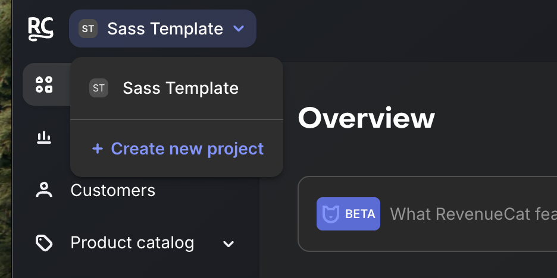

### Entitlement

1. Open `Product catalog` > `Entitlements`.
2. Create a new entitlement.
3. Use a clear identifier and display name, for example `pro_account`.

<a id="android-subscription-setup"></a>

### Android Subscription Setup 🤖

This flow moves between Google Play Console, Google Cloud Console, and RevenueCat.

#### 1. Create the app in Google Play Console

1. Create an app in [Google Play Console](https://play.google.com/console/u/0/developers/).
2. Use the package name from `app.json`.
3. Build your app if you have not already:

```bash
eas build
```

4. Download the generated `.aab` file.

#### 2. Create an internal release

1. In Google Play Console, open `Test and release` > `Internal testing`.
2. Click `Create new release`.
3. Upload the `.aab`.
4. Publish the release.

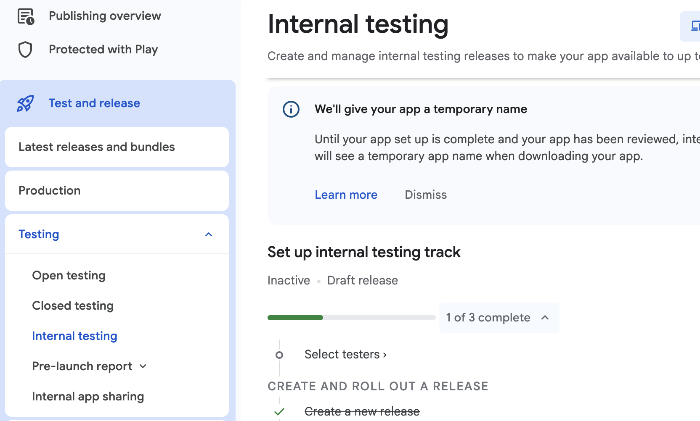

#### 3. Create the subscription

1. Open `Monetize with Play` > `Products` > `Subscriptions`.
2. Create a subscription.
3. Add a product ID such as `new_app_subscription`.
4. Add a display name and save.

#### 4. Add subscription benefits

1. Click `Add subscription benefits`.
2. Add the benefits your app provides.
3. Leave tax/compliance fields for later if needed.
4. Save.

#### 5. Add a base plan

1. Open the subscription again.
2. Add a base plan, for example `default`.
3. Enable auto-renewing.
4. Set billing period, grace period, countries, and pricing.
5. Save and activate.

#### 6. Create Google Cloud credentials

1. Open your [Google Cloud Console](https://console.cloud.google.com/).
2. Enable:
   - [Google Play Android Developer API](https://console.cloud.google.com/apis/library/androidpublisher.googleapis.com)
   - [Google Play Developer Reporting API](https://console.cloud.google.com/apis/library/playdeveloperreporting.googleapis.com)
3. Create credentials if prompted.

If the button is missing, you may already have credentials in that project.

Helpful video: [RevenueCat Android credentials walkthrough](https://www.youtube.com/watch?v=fOr2fu-0Vs8&t=2s)

#### 7. Create a service account

1. In the API credentials flow, choose `Application data`.
2. Create a service account.
3. Add these permissions:
   - `Pub/Sub Editor`
   - `Monitoring Viewer`
4. Finish the setup.
5. Copy the service account email from the `Credentials` tab.
6. Open `Manage service accounts`.
7. Create a new JSON key and download it.

#### 8. Enable Pub/Sub

Enable the [Cloud Pub/Sub API](https://console.cloud.google.com/apis/library/pubsub.googleapis.com?).

#### 9. Invite the service account in Google Play Console

1. Open `Users and permissions`.
2. Invite the service account email.
3. Grant app access to your app.
4. Enable these account permissions:
   - View app information and download bulk reports
   - View financial data, orders, and cancellation survey responses
   - Manage orders and subscriptions

At this point, the Android-side Google setup should be complete.

#### 10. Connect Google Play to RevenueCat

1. In RevenueCat, open `Apps`.
2. Click `+ Add app`.
3. Select `Google Play Store`.
4. Create a Play Store configuration with your Android package name.
5. Upload the JSON service account credentials.

It can take up to 36 hours for Google Play credentials to fully propagate.

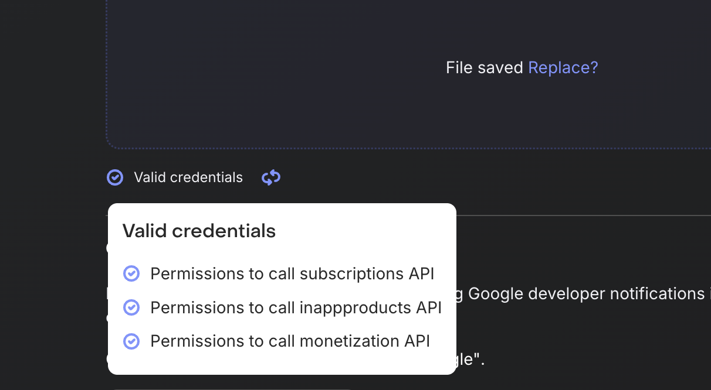

#### 11. Import the Google Play subscription into RevenueCat

1. In RevenueCat, open `Product catalog` > `Products`.
2. Click `New product`, then `Import`.
3. Select the subscription you created in Google Play.
4. Attach the entitlement.

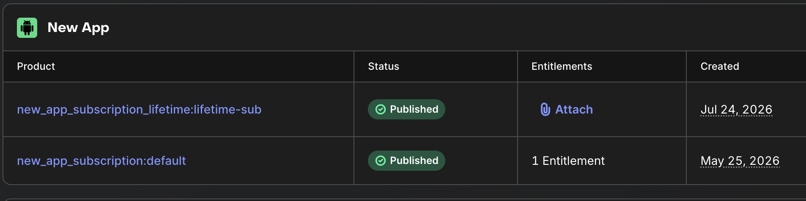

<a id="ios-subscription-setup"></a>

### iOS Subscription Setup 

Official guide: [RevenueCat iOS entitlements guide](https://www.revenuecat.com/docs/getting-started/entitlements/ios-products)

1. Build the app:

```bash
eas build
```

2. Submit it to App Store Connect:

```bash
eas submit -p ios
```

### App Store Connect Subscriptions

1. Open your app in [App Store Connect](https://appstoreconnect.apple.com/apps).
2. Under `Monetization`, open `Subscriptions`.
3. Create a subscription group.
4. Add localization details.
5. Create a subscription and configure:
   - Reference name
   - Product ID, for example `new_app_subscription_monthly`
   - Duration
   - Availability
   - Price
   - Localization
6. Back on the subscriptions overview page, configure a billing grace period.

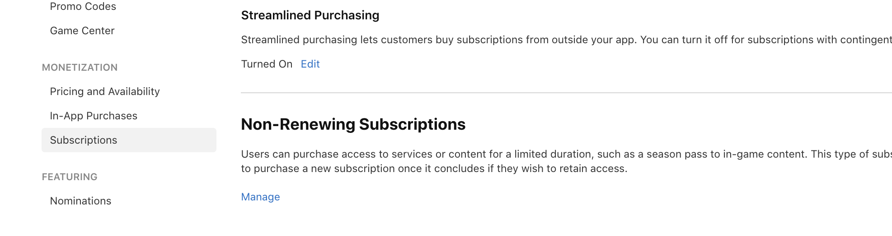

### In-App Purchase Key

1. Open [Users and Access](https://appstoreconnect.apple.com/access/users).
2. Select the `Integrations` tab.
3. Open `In-App Purchase`.
4. Generate a new key.
5. Download the key file.
6. Copy the Issuer ID.

### Connect App Store to RevenueCat

1. In RevenueCat, open `Apps`.
2. Create a new `App Store` app.
3. Add your iOS bundle ID.
4. Upload the key file.
5. Add the Issuer ID.
6. Save.

### Add the App Store product in RevenueCat

1. In RevenueCat, open `Product catalog` > `Products`.
2. Click `New Product`.
3. Choose your App Store product.
4. In App Store Connect, open the subscription and copy the product ID.
5. Paste that into RevenueCat as the identifier.
6. Add a display name.
7. Attach the entitlement.
8. Refresh and verify it saved correctly.

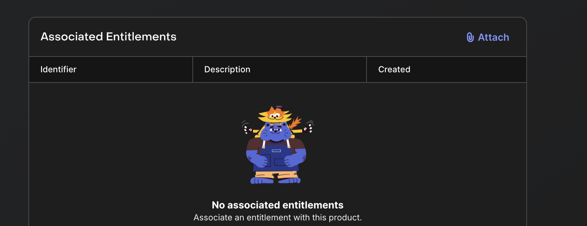

### Offerings

1. Open `Product catalog` > `Offerings`.
2. Click `+ New Offering`.
3. Add an identifier and display name.
4. Add packages such as monthly or annual.
5. Assign the matching products.

### API Keys

Copy these values into your env file:

```bash
EXPO_PUBLIC_REVENUECAT_APPLE_API_KEY=...
EXPO_PUBLIC_REVENUECAT_GOOGLE_API_KEY=...
EXPO_PUBLIC_REVENUECAT_ENTITLEMENT_ID=...
EXPO_PUBLIC_REVENUECAT_OFFERING_ID=...
```

You can find them in RevenueCat under:

- `App & providers` > `API keys`
- `Product catalog` > `Entitlements`
- `Product catalog` > `Offerings`

## Expo SDK and Upgrades

### Current versions

This template currently uses:

| Component    | Version              |
| ------------ | -------------------- |
| Expo SDK     | 54 (`expo ~54.0.35`) |
| React Native | 0.81.5               |
| React        | 19.1.0               |
| TypeScript   | 5.9.2                |

The New Architecture is enabled by default, and React Compiler is enabled through `expo.experiments.reactCompiler` in `app.json`. There is no `sdkVersion` field in the app config; Expo derives the SDK from the installed `expo` package.

As of August 2026, Expo SDK 57 is the latest stable release. Expo recommends upgrading one SDK at a time, so this project should move from 54 to 55, then 56, then 57 instead of skipping directly to 57.

### Before upgrading

1. Commit or back up the current working version.
2. Read the release notes for every target SDK: [SDK 55](https://expo.dev/changelog/sdk-55), [SDK 56](https://expo.dev/changelog/sdk-56), and [SDK 57](https://expo.dev/changelog/sdk-57).
3. Confirm the required Node.js, Android Studio/Gradle, and Xcode versions. SDK 55 and later require Node.js `20.19.4+`, and SDK 55 requires Xcode 26 for local iOS builds, plus macOS Tahoe
   \*There is a skill file in the project that help you further

## Troubleshooting

- Clear Metro cache: `npx expo start --clear`
- Clean native prebuild: `npx expo prebuild --clean`
- Review console warnings, especially native compatibility warnings
- If Android reports `Default FirebaseApp is not initialized`, confirm `google-services.json` matches the package in `app.json`, then rebuild the native app with `npx expo run:android`. Also stop stale Metro servers so the installed app connects to the current bundle.
- If no Expo push token is returned, confirm the device or emulator has Google Play services and that `expo.extra.eas.projectId` is set.

## Extra Resources

### Skills

- https://github.com/expo/skills
- https://skills.sh/trending

### Expo

- [Expo documentation](https://docs.expo.dev/)
- [Expo GitHub](https://github.com/expo/expo)
- [Expo Discord community](https://chat.expo.dev)
